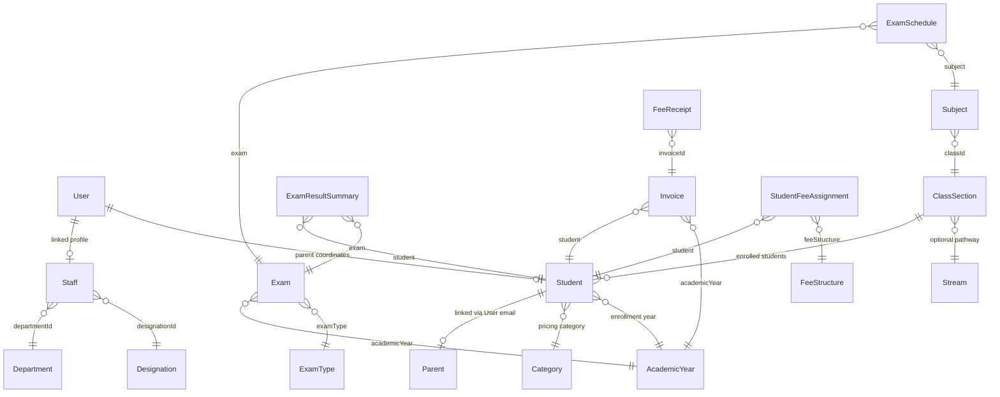

# Database Schema Specification

Springfield ERP utilizes MongoDB for storage with Mongoose acting as the Object-Data Modeling (ODM) layer. The database consists of interconnected collections storing academic structures, user sessions, student profiles, admissions records, examination grades, and financial registries.

---

## 1. Entity Relationship Model

Below is a structured map demonstrating the references and relationships between collections:

---

## 2. Core Collection Specifications

### 2.1 AcademicYear (`AcademicYear.js`)
Stores institutional terms.
- **`name`** (String, Required, Unique): e.g., `"2025-2026"`
- **`startDate`** (Date, Required)
- **`endDate`** (Date, Required)
- **`isActive`** (Boolean, Default: `true`)
- **`isCurrent`** (Boolean, Default: `false`)

### 2.2 Category (`Category.js`)
Configures demographic tiers for students.
- **`categoryName`** (String, Required, Unique, lowercase)
- **`categoryCode`** (String, Required, Unique, uppercase)
- **`description`** (String)
- **`status`** (String, Enum: `["Active", "Inactive"]`)

### 2.3 ClassSection (`ClassSection.js`)
Defines grade-section aggregates.
- **`className`** (String, Required): e.g., `"Class 10"`
- **`sectionName`** (String, Required): e.g., `"A"`
- **`maxStudents`** (Number, Default: `40`)
- **`classTeacher`** (ObjectId, Ref: `User`)
- **`stream`** (ObjectId, Ref: `Stream`)
- **`roomNumber`** (String)

### 2.4 User (`User.js`)
Stores authentication records.
- **`username`** (String, Required, Unique, Trim)
- **`email`** (String, Required, Unique, Trim)
- **`password`** (String, Required)
- **`role`** (String, Enum: `["ADMIN", "TEACHER", "PARENT"]`, Required)
- **`fullName`** (String, Required)
- **`photoUrl`** (String)
- **`assignedClasses`** (Array of Class Assignment Subdocuments): Used for Teachers to map subjects.
- **`status`** (String, Enum: `["Active", "Inactive", "Suspended"]`)

### 2.5 Student (`Student.js`)
Primary student database dossier.
- **`firstName`** / **`lastName`** (String, Required)
- **`admissionNo`** (String, Required, Unique)
- **`rollNo`** (String)
- **`email`** (String, Trim)
- **`className`** / **`sectionName`** (String, Required)
- **`dateOfBirth`** / **`gender`** (String/Date, Required)
- **`category`** (ObjectId, Ref: `Category`, Required)
- **`fatherEmail`** / **`motherEmail`** (String): Used to link to Parent `User` records.
- **`academicYear`** (ObjectId, Ref: `AcademicYear`, Required)
- **`status`** (String, Enum: `["Active", "Inactive", "Alumni", "Suspended"]`)

### 2.6 Admission (`Admission.js`)
Captures multi-step admission applications.
- **`applicationNo`** (String, Required, Unique)
- **`firstName`** / **`lastName`** (String, Required)
- **`className`** / **`sectionName`** (String, Required)
- **`category`** (ObjectId, Ref: `Category`, Required)
- **`fatherEmail`** / **`motherEmail`** (String)
- **`status`** (String, Enum: `["Submitted", "Verified", "Approved", "Rejected"]`)

### 2.7 Staff (`Staff.js`)
Stores payroll and dossier parameters for personnel.
- **`user`** (ObjectId, Ref: `User`, Required)
- **`employeeId`** (String, Required, Unique)
- **`email`** (String, Required, Unique)
- **`department`** (ObjectId, Ref: `Department`, Required)
- **`designation`** (ObjectId, Ref: `Designation`, Required)
- **`joiningDate`** (Date, Required)
- **`basicSalary`** (Number)

### 2.8 StudentAttendance (`StudentAttendance.js`)
Attendance registers for student roll calls.
- **`class`** / **`section`** (String, Required)
- **`date`** (Date, Required)
- **`student`** (ObjectId, Ref: `Student`, Required)
- **`status`** (String, Enum: `["Present", "Absent", "Late", "Half Day"]`)
- **`markedBy`** (ObjectId, Ref: `User`)

### 2.9 Exam (`Exam.js`)
Term assessment containers.
- **`examName`** (String, Required)
- **`examType`** (ObjectId, Ref: `ExamType`, Required)
- **`academicYear`** (ObjectId, Ref: `AcademicYear`, Required)
- **`applicableClasses`** (Array of Objects): Contains `classId`, `className`, and `sections`.
- **`startDate`** / **`endDate`** (Date, Required)
- **`status`** (String, Enum: `["Draft", "Scheduled", "Active", "Completed", "Published", "Cancelled"]`)

### 2.10 ExamSchedule (`ExamSchedule.js`)
Time slots for specific class subjects under an Exam.
- **`exam`** (ObjectId, Ref: `Exam`, Required)
- **`classId`** (ObjectId, Ref: `ClassSection`, Required)
- **`className`** / **`section`** (String, Required)
- **`subject`** (ObjectId, Ref: `Subject`, Required)
- **`examDate`** (Date, Required)
- **`startTime`** / **`endTime`** (String, Required)
- **`maxMarks`** / **`passingMarks`** (Number, Required)

### 2.11 ExamResultSummary (`ExamResultSummary.js`)
Topper computing registers.
- **`exam`** (ObjectId, Ref: `Exam`, Required)
- **`student`** (ObjectId, Ref: `Student`, Required)
- **`academicYear`** (ObjectId, Ref: `AcademicYear`, Required)
- **`className`** / **`section`** (String, Required)
- **`totalMaxMarks`** / **`totalMarksObtained`** (Number)
- **`percentage`** (Number)
- **`resultStatus`** (String, Enum: `["PASS", "FAIL", "WITHHELD", "ABSENT"]`)
- **`isPublished`** (Boolean, Default: `false`)

### 2.12 FeeStructure (`FeeStructure.js`)
Billing configurations.
- **`structureName`** (String, Required)
- **`academicYear`** (ObjectId, Ref: `AcademicYear`, Required)
- **`applicableClass`** (ObjectId, Ref: `ClassSection`, Required)
- **`feeHeads`** (Array of Objects): e.g. `[{ name: "Tuition", amount: 5000 }]`
- **`totalAmount`** (Number, Required)

### 2.13 StudentFeeAssignment (`StudentFeeAssignment.js`)
Fee schedules attached to individual students.
- **`student`** (ObjectId, Ref: `Student`, Required)
- **`feeStructure`** (ObjectId, Ref: `FeeStructure`, Required)
- **`dueDate`** (Date, Required)
- **`discountAmount`** (Number, Default: `0`)
- **`status`** (String, Enum: `["Unpaid", "Partially Paid", "Paid"]`)

---

## 3. Database Indexes

To maintain performance, the following indexes are declared:
- `User`: `{ email: 1 }` (Unique), `{ username: 1 }` (Unique)
- `Student`: `{ admissionNo: 1 }` (Unique), `{ className: 1, sectionName: 1 }`
- `Exam`: `{ examName: 1, academicYear: 1 }` (Unique)
- `ExamSchedule`: `{ exam: 1, classId: 1, section: 1, subject: 1 }` (Unique)
- `ExamResultSummary`: `{ exam: 1, student: 1 }` (Unique)
