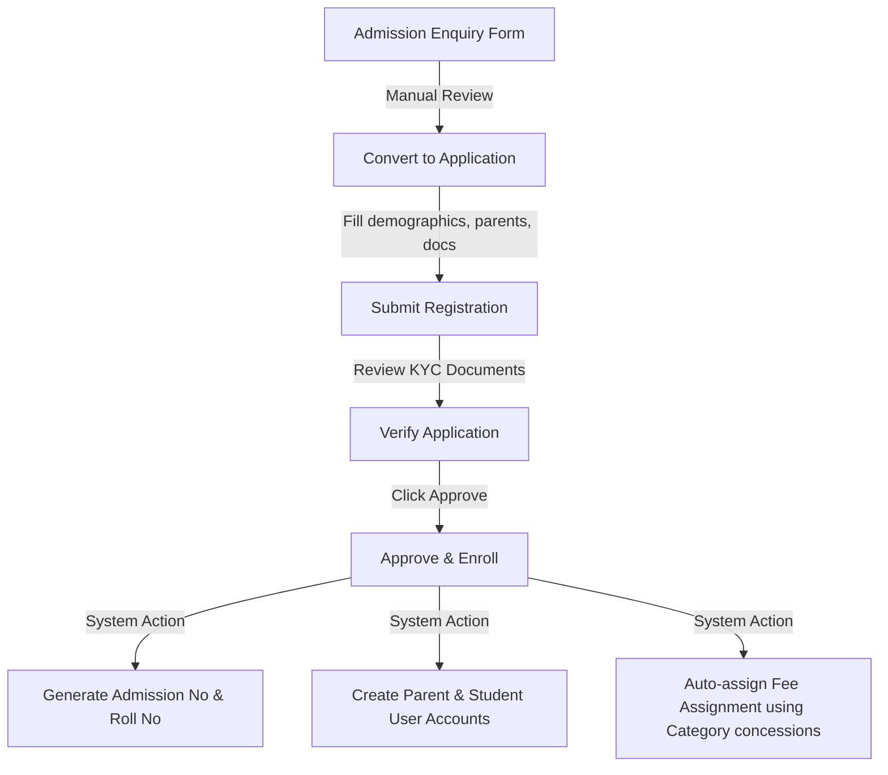
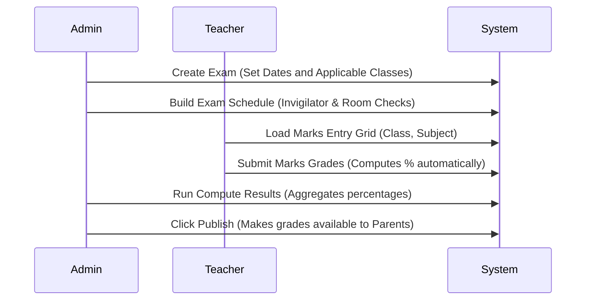

# Module Flow Specification

This guide documents the business logic workflows, user flows, and backend transaction sequences across Springfield ERP.

---

## 1. Master Setup Flow
Establish core metadata schemas before admitting students or generating fee sheets.

```text
  1. Define Academic Year (e.g. 2025-2026) -> Set Current
  2. Create Departments & Designations (Staff setup)
  3. Create Categories (e.g., General, OBC, SC, ST)
  4. Create Class Sections (e.g. Class 10 - Sec A)
  5. Create Subjects and map to Classes
  6. Configure Exam Types & Grade configurations
```

---

## 2. Admissions & Student Enrollment Flow
The conversion funnel from visitor guest query to approved active student.



---

## 3. Financial Collections & Billing Flow
Automatic invoice tracking, concessions application, and transaction receipt ledger generation.

```text
Admission Approval ──> Auto-assign Fee Assignment (Fee Assignment)
                            │
                            ▼
Invoice Generation ──> Applies Category Concession (Category Discount)
                            │
                            ▼
Record Cash Collection ──> Generates Receipt & Updates status to 'Paid'
```

---

## 4. Student Promotion Flow
Batch promotes students to the next grade level at the end of the academic term.

1. **Promotion Filter**: Admin filters students by current Academic Year, Class, and Section.
2. **Promote Command**:
   - Admin selects targeted target Class and Section.
   - The backend runs validation checks to ensure target configurations exist in the upcoming active Academic Year.
   - Updates the Student record's `className`, `sectionName`, and `academicYear`.

---

## 5. Examinations & Grading Flow
 Timetabling, teacher grading grids, and topper computing.



---

## 6. Authentication & RBAC Session Flow
How roles shape routing scopes, sidebars, and API data boundaries.

### 6.1 JWT Session Parsing
Upon client login:
1. User receives `accessToken` (with encoded User model id, email, and role) and `refreshToken`.
2. Axios headers attach: `Authorization: Bearer <accessToken>`.

### 6.2 Sidebar & Dashboard Routing
- **Admin**: Complete view. Access to Master Setup, Admissions, Promotions, Staff Directories, Finance Collections, and Global KPIs.
- **Teacher**: Scoped view. Can view Today's Classes, list assigned students in their `assignedClasses`, mark section attendance, and submit marks.
- **Parent**: Dedicated child portal. Selects linked child to view overall attendance rates, fee invoices status, exam results, and schedule calendars.
