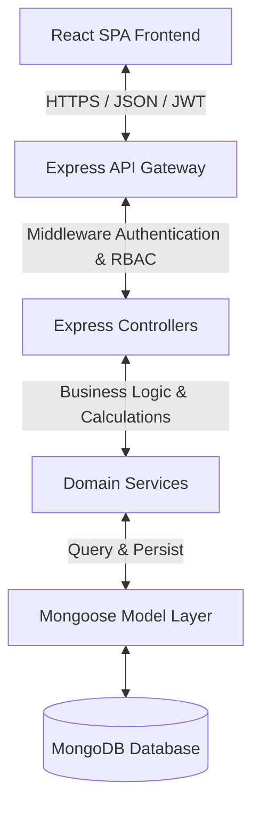

# Project Portfolio Overview: Springfield ERP

Springfield ERP is a production-grade, enterprise-scale School Resource Planning and Management System. Designed for educational institutions, it streamlines student records, academic sessions, examinations, and financial operations.

---

## 1. Problem Statement

Educational institutions face complex administrative overhead due to fragmented systems. Common issues include:
- **Data Silos**: Admission desks, attendance tracking, and finance teams often work in isolation, causing sync errors.
- **Scheduling Conflicts**: Manually creating exam timetables often results in double-booked rooms or over-allocated teachers.
- **Invoicing Errors**: Complex billing configurations (discounts, tuition heads, waivers) can lead to payment discrepancies and delayed audits.
- **Manual Grading Calculations**: Teachers spend hours manually aggregating marks, ranking students, and calculating grade percentages.

---

## 2. Solution

**Springfield ERP** addresses these inefficiencies with an integrated MERN platform:
- **Centralized Database**: A unified MongoDB schema ensures real-time updates for student data across admissions, classes, and billing.
- **Automated Billings**: Automatic fee structures map to student profiles during enrollment, applying category-specific discounts instantly.
- **Conflict Detection Algorithms**: Checks ensure no classroom, invigilator, or subject is double-scheduled during exams.
- **Grading & Ranking Engine**: Automates terminal calculations, enabling instant topper ranking, class averages, and pass/fail statuses.

---

## 3. System Architecture

Springfield ERP is built with a separated client-server model to support modular growth and independent deployments.

### Key Technical Patterns
- **JWT-Based Stateless Auth**: Implements secure cookie storage for refresh tokens and bearer tokens for stateless authorization.
- **Domain Services Model**: Decoupled controllers delegate business logic (e.g., fee assignment, grade calculations) to services.
- **Dependent Delete Guarantees**: Restricts deleting critical masters (e.g., class, exam) if dependent records (students, marks) are active.
- **Audit Trails**: Logs all financial adjustments (discounts, waivers, refunds) and exam modifications.

---

## 4. Key Modules & Features

### A. Academic Master Setup
Supports setup for:
- Multiple concurrently active Academic Years.
- Stream definitions (Science, Commerce, Humanities) for high-school configurations.
- Categorization systems for demographic fee adjustments.

### B. Admissions Workflow
- Prefilled forms route successful inquiries to student applications.
- Document checking step verifies student certificates before database enrollment.
- Enrollment triggers automatic creation of parent and student portal credentials.

### C. Finance & Billing Engine
- Automated installment split algorithms (Annual, Half-Yearly, Quarterly, Monthly).
- Late fee rules calculate daily, weekly, or percentage fines upon overdue status.
- Print-friendly invoice receipts.

### D. Examination & Analytics
- Multi-subject bulk marks entry grids.
- Grade config structures mapped class-wise.
- Ranks computed dynamically based on percentage averages.

---

## 5. Business Impact

- **Admin Time Reduction**: Automating enrollment billing processes cuts processing time per student down from hours to minutes.
- **Zero Double-Bookings**: Conflict detection rules eliminate scheduling overlaps, saving administrative coordination hours.
- **Financial Audit Trail**: Secure financial logs prevent collection leaks and ensure transparent payment collection.
- **Enhanced Teacher Productivity**: Single-click marks entry and grading configurations free up teachers' schedules for instruction.

---

## 6. Future Enhancements

1. **Role-Based Portals**: Dedicated portals for parents, students, and invigilator dashboards.
2. **Biometric Integration**: API endpoints to pull direct logs from RFID and biometric scanners.
3. **Automated Alerts**: Email and SMS alerts for invoicing deadlines.
4. **Machine Learning Analytics**: Performance forecasting alerts to identify students needing extra help.
