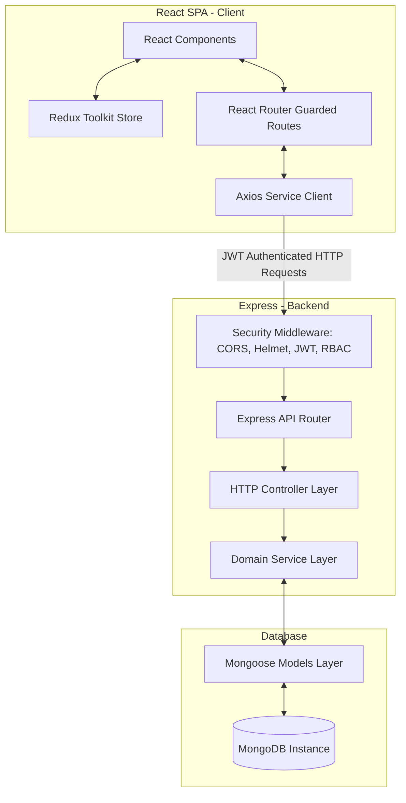

# System Architecture

Springfield ERP is engineered using a robust, clean, and decoupled Client-Server architecture utilizing the **MERN (MongoDB, Express, React, Node.js)** software stack. The codebase is organized as a unified workspace separating backend REST API services from the frontend single-page React client application.

---

## 1. Core Architectural Layout

The system architecture enforces a clean separation of concerns, decoupling client presentation rules from backend business logic.



---

## 2. Component Design & Abstraction Layers

### 2.1 Backend Architecture (API Service)
The backend service utilizes a modular controller-service-model design pattern, structured as follows:

1. **Routing Layer (`src/routes/`)**: Receives incoming HTTP requests, maps them to URL routes, and binds them to respective controllers.
2. **Middleware Filter Layer (`src/middlewares/`)**: Evaluates incoming request headers for session security:
   - `authMiddleware`: Parses, validates, and decodes incoming JSON Web Tokens (JWT) inside request headers.
   - `roleMiddleware`: Evaluates decoded JWT payload roles (`ADMIN`, `TEACHER`, or `PARENT`) against allowed route permissions.
3. **Controller Layer (`src/controllers/`)**: Manages HTTP transactions. Extracts route parameters, body payloads, and query filters, delegates tasks to service layers, and returns JSON payloads with corresponding HTTP status codes.
4. **Model Schema Layer (`src/models/`)**: Mongoose modeling layer defining database entity structure, schemas, field validators, and secondary database index mappings.

### 2.2 Frontend Architecture (Single Page Application)
The React client operates as a rich SPA managed by Vite:

1. **Client Route Protection (`src/routes/ProtectedRoute.jsx`)**: Guard components checking authentication states and permissions before rendering target page views.
2. **State Orchestration Layer (`src/redux/`)**: Centralized single source of truth managed via **Redux Toolkit (RTK)**. Redux slices coordinate authentication statuses, session user objects, and global state layouts.
3. **HTTP API Communication Layer (`src/services/api.js`)**: Configured Axios client instances with automated request interceptors (injecting authorization headers) and response interceptors (redirecting on `403 Forbidden` credentials).

---

## 3. Session & Security Subsystems

### 3.1 Authentication Workflow
Springfield ERP utilizes stateless **JSON Web Token (JWT)** credentials:

1. **Authentication Token (Short-lived)**: Transmitted inside request header authentication vectors: `Authorization: Bearer <token>`.
2. **Role Enforcements**: Roles are encoded directly inside the JWT payload. The backend extracts, parses, and validates these roles at runtime to enforce role-based access control policies.

```text
[ Client Login Request ] ──> [ Auth Controller (Verifies Hash) ]
                                            │
                                            ▼
[ Client Stores Credentials ] <── [ Encrypted Token Signed & Returned ]
```

### 3.2 Backend Security Hardening
- **Helmet**: Secures Express headers to block clickjacking, cross-site scripting (XSS), and injection vulnerabilities.
- **CORS Configuration**: Restricts origin matching to prevent cross-origin resource sharing leakage.
- **Password Hashing**: Implements salted bcrypt hashes to securely store credentials.
